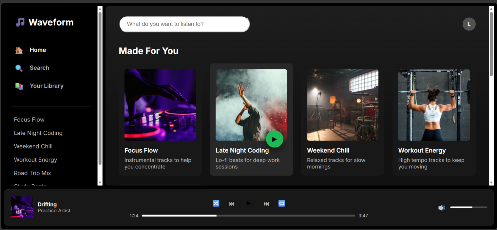
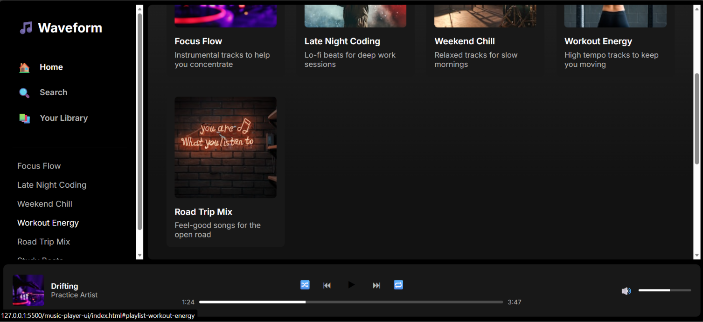
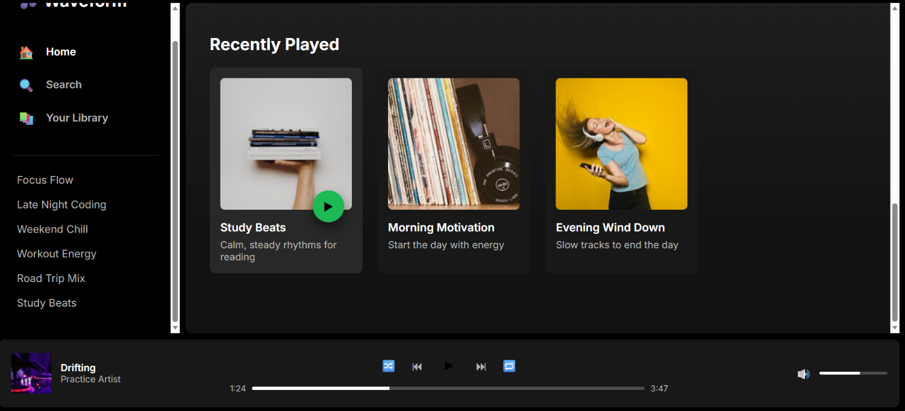

# Music Player UI

A Spotify-inspired music player interface built using HTML5 and CSS3 as a frontend learning project.

## 📌 About the Project

This project is a practice music player interface designed to recreate the look and layout of a modern music streaming application.

The interface includes a sidebar navigation, playlist sections, music cards, search bar, profile area, and a bottom music player with playback controls, progress bar, and volume control.

The project focuses on creating a polished and responsive user interface using only HTML and CSS, without JavaScript.

## ✨ Features

* Spotify-inspired dark theme
* Sidebar navigation
* Playlist navigation
* Search bar
* Music playlist cards
* Hover effects on music cards
* Animated play buttons
* Recently Played section
* Bottom music player
* Playback control buttons
* Progress bar
* Volume control
* CSS-only playlist highlighting using the `:target` pseudo-class
* Responsive layout for smaller screens
* Smooth visual transitions

## 🛠️ Technologies Used

* HTML5
* CSS3
* Google Fonts (Inter)
* Unsplash images

## 📂 Project Structure

```text
music-player-ui/
│
├── index.html
├── styles.css
├── README.md
└── screenshots/
    ├── music-player-page-1.png
    ├── music-player-page-2.png
    └── music-player-page-3.png
```

## 🚀 How to Run

1. Clone this repository:

```bash
git clone https://github.com/Lokeswari684/music-player-ui.git
```

2. Open the project folder.

3. Open `index.html` in a web browser.

No additional installation or dependencies are required.

## 🎯 Learning Outcomes

Through this project, I practiced:

* Structuring complex layouts using HTML
* Using CSS Grid for the overall application layout
* Using Flexbox for alignment
* Creating responsive layouts
* Designing reusable music cards
* Creating hover effects and CSS transitions
* Positioning elements using CSS
* Creating a fixed-style music player layout
* Using the `:target` pseudo-class for navigation
* Working with media queries
* Improving spacing, typography, and visual presentation

## 📸 Project Preview

### Music Player Page - 1



### Music Player Page - 2



### Music Player Page - 3



## 👩‍💻 Author

**Lokeswari Gonugunta**

GitHub: [Lokeswari684](https://github.com/Lokeswari684)
